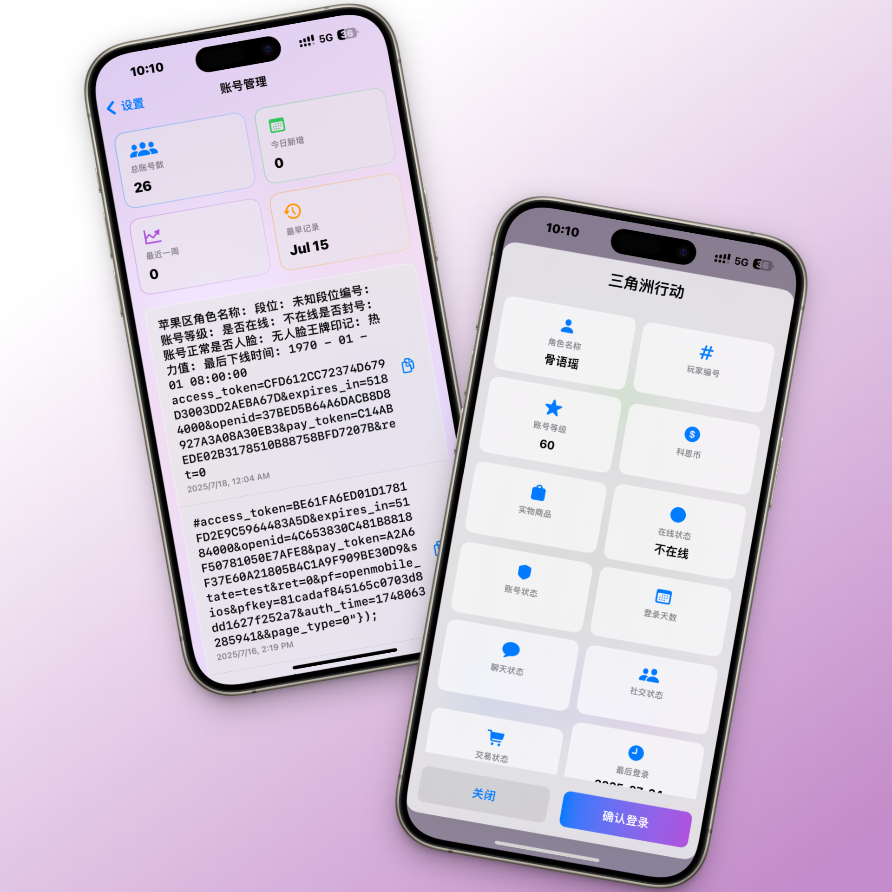

# 上号器Pro

<p align="center">
    
    
    
    
</p>

一个基于 SwiftUI 开发的现代化数据号登录工具，支持 iOS 和 iPad 平台。采用了流行的液态玻璃设计风格，为用户提供了优雅且高效的使用体验。

## 📱 预览

<table>
  <tr>
    <td></td>
    <td></td>
  </tr>
</table>

## ✨ 特性

- 🎨 精美的液态玻璃设计风格
- 🔐 安全的登录态管理
- 📱 iOS/iPad 跨设备支持
- 🌐 多游戏平台支持
- 📊 账号数据可视化
- ⚡️ 高效的性能优化
- 🔄 自动更新检测
- 🎮 游戏直接跳转
- 💾 账号数据本地存储
- 🌙 统一的玻璃态主题

## 🚀 快速开始

### 系统要求

- iOS 15.0+
- Xcode 14.0+
- Swift 5.5+

### 安装步骤

1. 克隆项目
```bash
git clone https://github.com/pxbug/LogUpPro.git
```

2. 打开项目
```bash
cd LogUpPro
open LogUp\ Pro.xcodeproj
```

3. 运行项目
- 选择目标设备（iPhone/iPad）
- 点击运行按钮或按下 `Cmd + R`

## 🛠 技术栈

- **SwiftUI** - 用户界面框架
- **Combine** - 响应式编程
- **URLSession** - 网络请求
- **UserDefaults** - 数据持久化
- **async/await** - 异步编程

## 📦 主要功能

### 登录功能
- 支持多种游戏平台登录
- 自动识别游戏类型
- 登录态安全存储
- 登录历史记录

### 账号管理
- 账号数据统计
- 历史记录查看
- 数据导出功能
- 快速复制功能

### 设置中心
- 应用配置管理
- 缓存清理
- 数据重置
- 关于信息

## 🤝 参与贡献

欢迎提交 Pull Request 或 Issue！

1. Fork 项目
2. 创建特性分支 (`git checkout -b feature/AmazingFeature`)
3. 提交更改 (`git commit -m 'Add some AmazingFeature'`)
4. 推送到分支 (`git push origin feature/AmazingFeature`)
5. 打开 Pull Request

## 📝 开源协议

本项目基于 Apache-2.0 协议开源 - 查看 [LICENSE](LICENSE) 文件了解更多细节

## 👥 联系方式

- 电子邮件：iTroll@qq.com
- Telegram：[@iTroll886](https://t.me/iTroll886)
- QQ：2171679131
- 官方交流群：[Telegram](https://t.me/iTroll886)

## 🙏 致谢

感谢所有为这个项目做出贡献的开发者！

---

**免责声明**：本项目仅供学习交流使用，请勿用于非法用途。使用本项目造成的任何问题，开发者不承担任何责任。
